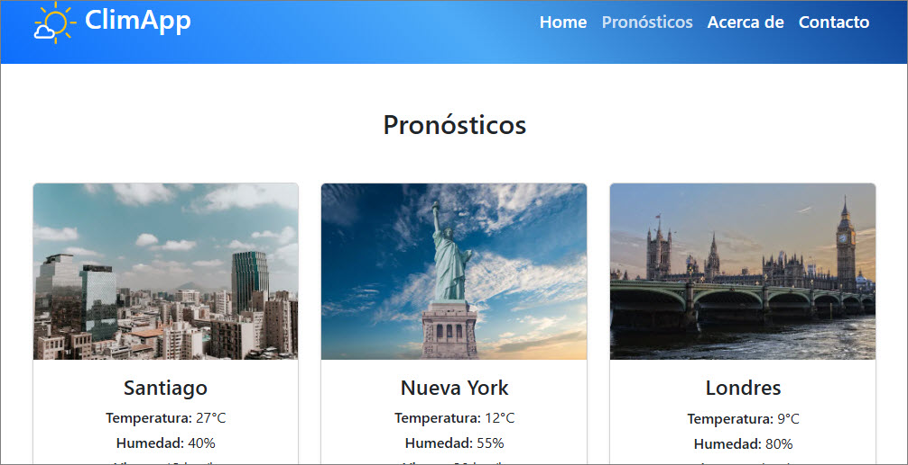
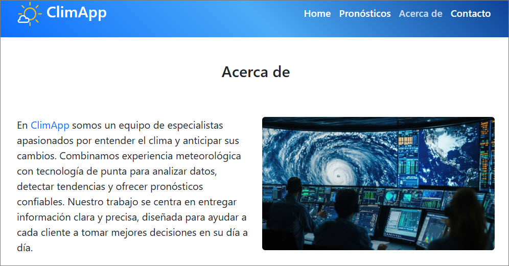
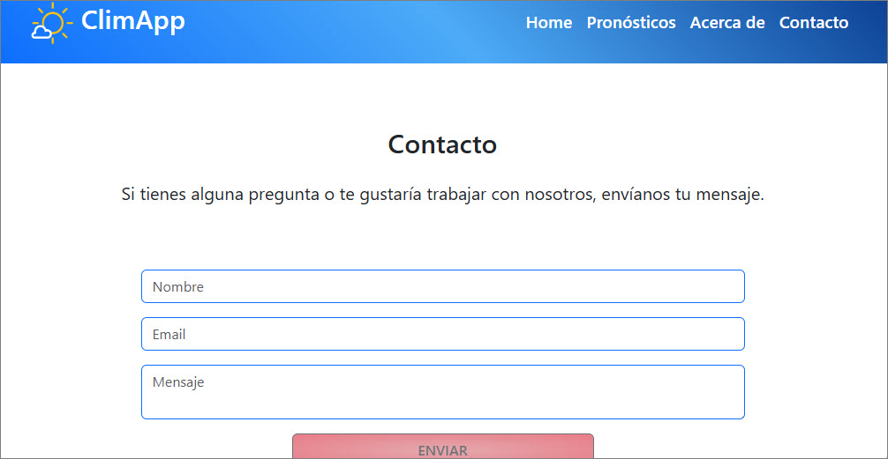
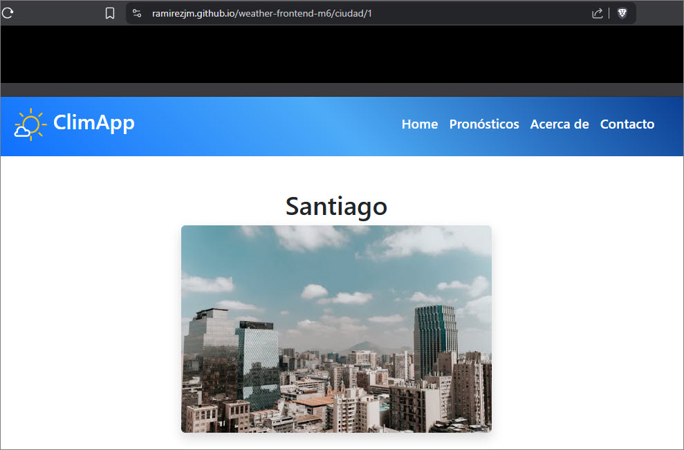
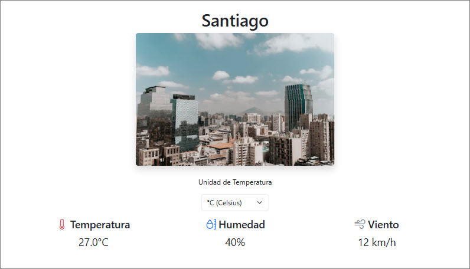
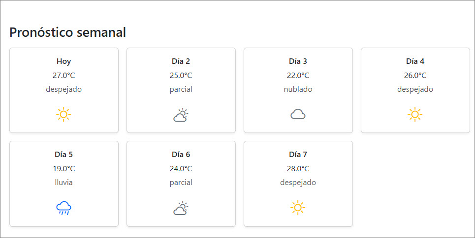
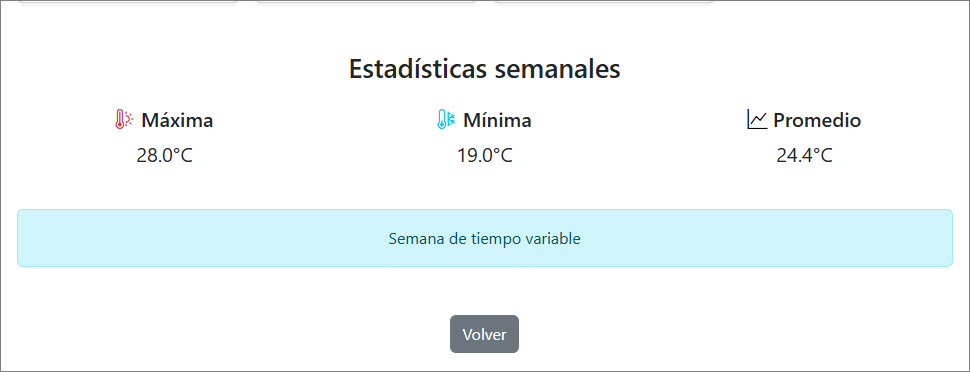
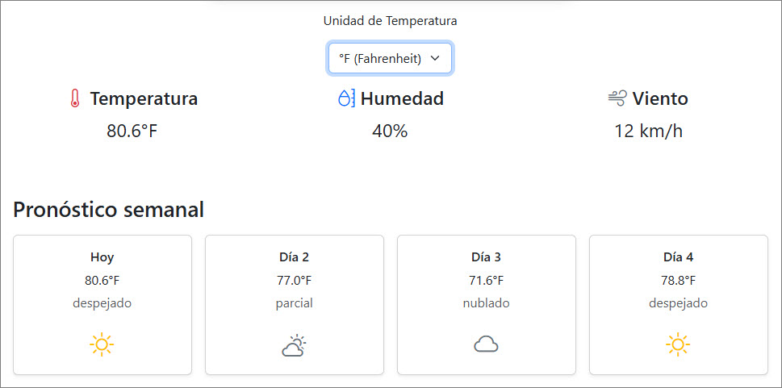
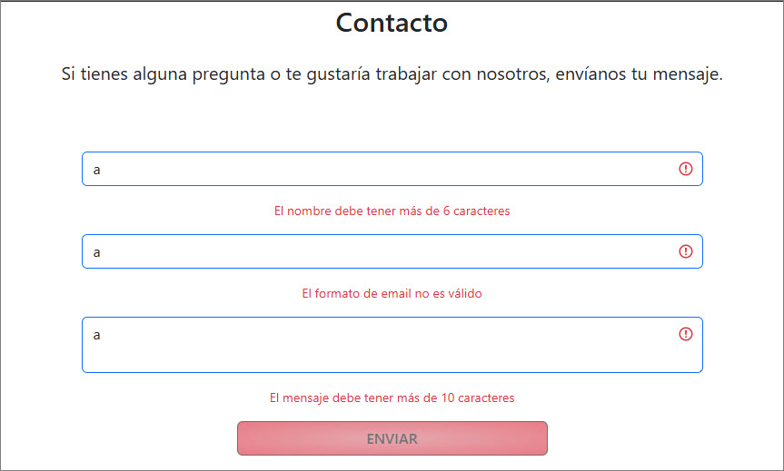

# weather-frontend-m6
Proyecto portafolio / Módulo VI / Bootcamp Frontend TD

Visita el proyecto en: https://ramirezjm.github.io/weather-frontend-m6/

ClimApp es una aplicación que entrega pronósticos meteorólogicos precisos y personalizados. Ofrecemos una muestra de nuestro trabajo con una selección de distintas ciudades del mundo.

[](https://choosealicense.com/licenses/mit/)


### Modelado de datos

- La aplicación trabaja con un array de objetos que representa distintas ciudades.
- Cada ciudad contiene información general del clima actual (temperatura, estado, humedad y viento) y un array adicional con el pronóstico de la semana.

Este modelo permite reutilizar los datos para generar de forma dinámica las tarjetas de ciudades y el contenido de la vista de detalles.

```Javascript
{
    id: 1,
    nombre: "Santiago",
    imagen: new URL('@/assets/images/ciudades/santiago.webp', import.meta.url).href,
    icono: "despejado",
    temperatura: 27,
    estado: "despejado",
    humedad: 40,
    viento: 12,
    pronosticoSemana: [
      { dia: "Hoy", icono: 'despejado', temperatura: 27, estado: "despejado" },
      { dia: "Día 2", icono: "parcial", temperatura: 25, estado: "parcial" },
      { dia: "Día 3", icono: "nublado", temperatura: 22, estado: "nublado" },
      { dia: "Día 4", icono: "despejado", temperatura: 26, estado: "despejado" },
      { dia: "Día 5", icono: "lluvia", temperatura: 19, estado: "lluvia" },
      { dia: "Día 6", icono: "parcial", temperatura: 24, estado: "parcial" },
      { dia: "Día 7", icono: "despejado", temperatura: 28, estado: "despejado" }
    ]
  }
```

### Vistas
La aplicación cuenta con las siguientes vistas:
- Home
<div>
  
</div>

- Pronósticos
<div>
  
</div>

- About
<div>
  
</div>

- Contacto
<div>
  
</div>

- Detalle, una vista que se carga de manera dinámica y que muestra el detalle de cada ciudad
<div>
  
</div>

### Rutas
La aplicación usa vue-router para manejar las rutas entre cada vista, agregando lazy loading para la ruta dinámica que muestra el detalle de cada ciudad, de manera que se muestre solo cuando se navega a /ciudad/:id

```Javascript
const routes = [
  {
    path: '/',
    name: 'home',
    component: Home
  },
  {
    path: '/about',
    name: 'about',
    component: About
  },
  {
    path: '/contacto',
    name: 'contacto',
    component: Contacto
  },
  {
    path: '/pronosticos',
    name: 'pronosticos',
    component: Pronosticos
  },
  {
    path: '/ciudad/:id',
    name: 'CiudadDetalle',
    component: () => import('@/views/CiudadDetalle.vue')
  }
]
```

### Detalle de cada ciudad
Cada tarjeta de ciudad cuenta con un botón 'ver detalles', que permite navegar a su pronóstico detallado:
- Información del lugar seleccionado (nombre, clima actual).
- Pronóstico a 7 días
- Estadísticas de la semana (temperatura máxima, mímina, tendencia, etc.)

<div>
  
  
  
</div>

- Además, contiene una interacción extra: usando v-model un formulario permite cambiar la unidad de temperatura.

<div>
  
</div>


### Formulario interactivo
La vista de Contacto contiene un formulario interactivo, que cuenta con mensajes de accesibilidad para el usuario, validaciones y mensaje de envío correcto.

<div>
  
</div>


#### 1. Clonar el repositorio

  ```bash
   git clone https://github.com/RamirezJM/weather-frontend-m6.git
   cd weather-frontend-m6
```

#### 2. Instalar dependencias

```bash
npm install
```

#### Levantar el servidor

```bash
npm run dev
```
